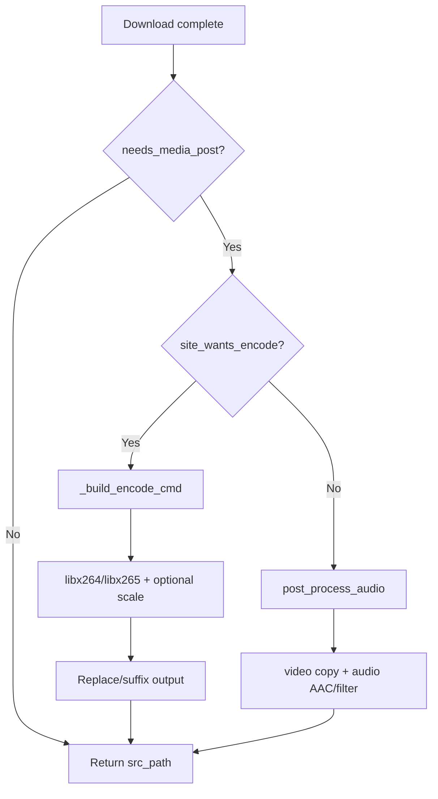
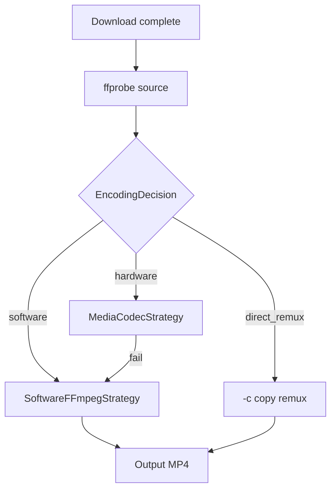

# Encoding Architecture (Current State)

> Phase 0 audit — documents the repository **before** encoding optimization work.
> Last updated: 2026-09-20

## Overview

JAV Downloader is a Python 3.10+ application with:

- **Headless CLI** (`jav-downloader-cli`) for batch downloads
- **Web UI** (`jav-web`) — SolidJS frontend + Python HTTP server
- **Site extractors** that resolve HLS or direct MP4 streams from supported sites
- **FFmpeg** for remux, time cuts, optional post-download encode, and audio processing

The encoding optimization work targets the **post-download media pipeline** and future hardware encoding — not the HLS segment download path itself.

---

## Repository Layout (Relevant Paths)

```
src/jav_downloader/
├── cli/                    # CLI entry points (headless has no encode flags yet)
├── core/                   # Config, paths, SSL, video identity
├── sites/
│   ├── base.py             # M3U8Crawler, HLS merge/remux, locate_ffmpeg()
│   ├── media_post.py       # ★ Post-download encode + audio (main target)
│   ├── audio_post.py       # Re-exports from media_post
│   ├── direct_mp4.py       # Progressive MP4 download + ffmpeg time cuts
│   ├── multi_cut.py        # Multi-range cuts via ffmpeg
│   └── output_meta.py      # HLS tier metadata, size estimation
└── web/
    ├── server.py           # HTTP server
    ├── service.py          # Resolve/download API, encode option mapping
    ├── jobs.py             # Background download workers
    └── progress_phase.py     # Log → UI phase labels

web/frontend/               # SolidJS source (Vite build → web/static/)
tests/                      # pytest suite
```

---

## End-to-End Download Flow

### HLS path (most sites)

```
URL resolve → master/media playlist → segment download (TS, AES decrypt)
    → binary concat (merged.ts)
    → ffmpeg remux (-c copy) → out.mp4
    → post_process_media() [optional encode/audio]
    → final .mp4
```

Implemented in `M3U8Crawler._mergeMp4Chunks()` and `_remux_to_mp4()` in `base.py`.

### Direct MP4 path

```
URL resolve → ranged HTTP download (or ffmpeg stream cut for time range)
    → post_process_media() [optional encode/audio]
    → final .mp4
```

Implemented in `direct_mp4.py`.

### Multi-cut path

Per-range HLS download or remote ffmpeg cut → concat demuxer (`-c copy`) → `post_process_media()`.

Implemented in `multi_cut.py`.

---

## FFmpeg Invocation Points

| Location | Purpose | Video | Audio |
|----------|---------|-------|-------|
| `base.py::_remux_to_mp4` | TS → MP4 after HLS merge | `-c copy` | `-c copy` |
| `media_post.py::_build_encode_cmd` | Optional size-reduction encode | libx264 / libx265 + scale | AAC or copy via `_append_audio_mapping` |
| `media_post.py::post_process_audio` | Audio-only rewrite | `-c:v copy` | AAC / filters / mute |
| `direct_mp4.py::_download_ffmpeg_cut` | Remote time-range cut | copy (via `append_ffmpeg_output_args`) | copy or AAC |
| `multi_cut.py::_extract_clip` | Remote/local clip extract | typically re-encode or copy | varies |
| `multi_cut.py::_concat_clips` | Join clips | `-c copy` | `-c copy` |

**FFmpeg discovery:** `base.locate_ffmpeg()` — companion binary → PATH → `imageio_ffmpeg`. Cached globally.

**Process lifecycle:** Active ffmpeg PIDs stored on site as `site._ffmpeg_proc`; killed on cancel/pause via `_stop_workers()`.

---

## Current Encoding Flow (Post-Download)

Entry point: `media_post.post_process_media(site, src_path, duration_sec)`.

### Trigger conditions

```python
needs_media_post(site) = site_wants_encode(site) OR needs_audio_processing(site)
```

- **Encode:** user enables `_encode_enabled` (web UI checkbox “Re-encode after download”).
- **Audio processing:** mute, fade, loudnorm, volume boost, or non-default audio bitrate.

If neither applies, the downloaded MP4 is returned unchanged.

### Encode command construction

`_build_encode_cmd()` in `media_post.py` builds:

```
ffmpeg -y -hide_banner -loglevel error -nostats -progress pipe:1
  -threads N
  -i SRC
  [ -vf scale=-2:MAX_HEIGHT ]     # if max_height > 0
  -c:v libx264|libx265 -crf CRF -preset PRESET
  [ audio mapping ]
  -movflags +faststart DST
```

**Defaults / resolution:**

| Setting | Normalizer | Default / Auto |
|---------|------------|----------------|
| Codec | `normalize_encode_codec` | `h264` |
| CRF | `normalize_encode_crf` | 23 (clamped 18–28) |
| Max height | `normalize_encode_max_height` | 0 = original; 480/720/1080 |
| Preset | `resolved_encode_preset` | `veryfast` on Termux/Linux-with-Termux; else `medium` |
| Threads | `resolved_encode_threads` | `os.cpu_count()` when 0 |
| Output mode | `normalize_encode_output_mode` | `replace` / `keep_both` / `suffix` |

**Termux detection:** `_is_termux_like()` checks `TERMUX_VERSION` or Linux + `/data/data/com.termux`.

### Audio mapping (`_append_audio_mapping`)

When video is copied:

- Mute → `-c:v copy -an`
- No audio rewrite → `-c copy`
- Filters or non-default bitrate → `-c:v copy -c:a aac -b:a Nk [-af …]`

When video is re-encoded, audio follows the same rewrite rules without `-c:v copy`.

### Progress reporting

- Encode phase: `site._progress_phase('Encoding', detail)` and `_emit_job_log`.
- Byte progress via `-progress pipe:1` and `_read_ffmpeg_progress`.
- UI maps log lines in `progress_phase.phase_from_log()`.

---

## What Is **Not** Implemented Today

1. **No source inspection (ffprobe)** — encode always runs full decode→scale→encode when enabled, even if source already matches target codec/resolution.
2. **No direct/remux in post-process** — remux only happens at HLS merge; post-encode never chooses stream copy.
3. **No hardware encoding** — only `libx264` / `libx265`.
4. **No encoder strategy abstraction** — single `_build_encode_cmd()` function.
5. **No capability detection** — preset auto only distinguishes Termux vs desktop.
6. **No advanced encoding UI** — all controls visible when encode tool is expanded (no opt-in advanced section).
7. **No encoding engine selection** (Auto / Direct / Hardware / Software).
8. **CLI headless** does not expose encode options (web UI only via API payload).

---

## Settings Persistence

### Web frontend (`web/frontend/src/lib/persist.ts`)

LocalStorage keys:

- `jav-downloader-encode-settings` — `EncodeSettings` JSON
- `jav-downloader-remember-encode` — persist toggle

Default encode settings: disabled, H.264, CRF 23, original height, preset auto, threads 0.

### Backend API (`web/service.py`)

`_encode_options_from_mapping()` maps JSON fields:

- `encode`, `encode_codec`, `encode_crf`, `encode_max_height`
- `encode_output_mode`, `encode_preset`, `encode_threads`

Applied via `M3U8Crawler.__init__` → `media_post.apply_encode_options()`.

Site object holds runtime state as `site._encode_*` attributes (not a separate config class).

---

## Web UI (Current Encode Controls)

Located in `EditToolsCard.tsx` under the “encode” tool tab:

- Enable re-encode checkbox
- Codec (H.264 / HEVC)
- CRF slider (18–28) with tooltip
- Max height (original / 480 / 720 / 1080)
- Preset dropdown with tooltip
- Output mode (replace / keep both / tagged only)
- Threads (auto or 1–N)

Tooltips exist for Codec, CRF, and Preset via `FieldHint`. No hardware-specific controls yet.

Frontend build output is committed to `src/jav_downloader/web/static/` for Termux (no Node required at runtime).

---

## HLS Merge / Remux Details

After segments are concatenated to `merged.ts`:

```python
ffmpeg -y -hide_banner -loglevel error -fflags +genpts -i merged.ts
  -c copy -movflags +faststart -avoid_negative_ts make_zero out.mp4
```

Fallback: if ffmpeg fails, raw `merged.ts` is published (playable but seeking may be poor).

Temp workdir: `jav-remux-*` under destination folder (avoids filling system temp on another drive).

Then `post_process_media()` may re-encode the remuxed MP4 — **double ffmpeg pass** when encode is enabled.

---

## Platform Detection (Existing)

| Signal | Usage |
|--------|-------|
| `os.name == 'nt'` | Windows: CREATE_NO_WINDOW, short paths for ffmpeg |
| `TERMUX_VERSION` / Termux path | Faster x264 preset default |
| `platform.system()` | Mirror / user-agent hints |
| `os.cpu_count()` | Default thread count |

No Android MediaCodec, GPU, or VAAPI/NVENC detection exists.

---

## Tests (Encoding-Related)

| File | Coverage |
|------|----------|
| `tests/test_media_post.py` | Normalizers, encode tag, destination paths, audio filters |
| `tests/test_progress_phase.py` | Encoding log → UI phase |
| `tests/test_web_cleanup.py` | Temp file cleanup for `jav-encode-*` |
| `tests/test_hls_cut.py`, `test_direct_mp4.py` | Cut/download paths |

No tests for encoder selection, remux-vs-encode decisions, or hardware encoding.

---

## Planned Changes (High Level)

### Phase 1 — Encoding decision / direct remux

- Add `ffprobe`-based source inspection module.
- Before encode, decide: **remux/copy** vs **re-encode**.
- Skip scale/encode when source codec, resolution, and audio already satisfy targets.
- Preserve user override to force re-encode when encode is enabled.

### Phase 2 — Encoder abstraction

- Minimal strategy layer: DirectRemux, SoftwareFFmpeg, (stub) Hardware.
- Centralize ffmpeg argument generation currently in `_build_encode_cmd`.

### Phase 3–4 — Android MediaCodec + capability detection

- `h264_mediacodec`, `hevc_mediacodec` with runtime validation.
- GOP configuration, bitrate/VBR (not CRF).
- Graceful fallback to software.

### Phase 5 — Advanced UI

- Opt-in “Advanced Encoding Settings” with tooltips on every technical control.
- Capability-aware disable/hide for unsupported encoders.

### Phase 6–8 — Benchmarks, desktop HW, app-level perf

### Phase 9 — Document-only root optimization roadmap

See future `docs/android-root-performance-optimization.md`.

---

## Phase 1 — Proposed Minimal Changes

**New module:** `src/jav_downloader/sites/media_probe.py`

- `probe_media(path) -> MediaInfo` (codec, width, height, pix_fmt, audio codec, duration)
- Uses `ffprobe` via subprocess (same discovery pattern as ffmpeg).

**New module:** `src/jav_downloader/sites/encoding_decision.py`

- `decide_encoding(site, media_info) -> EncodingDecision`
- Returns mode: `direct_remux` | `software_encode` (+ reasons for logging)
- Rules (initial):
  - If encode disabled but audio processing needed → existing audio-only path.
  - If encode enabled:
    - If source video codec matches target (h264/hevc), height ≤ max_height (or max_height=0), no audio rewrite → **direct remux** with `-c copy`.
    - If only height exceeds max_height → re-encode with scale.
    - If codec mismatch (e.g. user wants HEVC, source is H.264) → re-encode.
    - If audio filters/bitrate/mute required → may force audio re-encode while video copies when compatible.

**Changes to `media_post.py`:**

- Call decision layer from `post_process_media`.
- Add `_build_remux_cmd()` for copy path.
- Structured encoding decision logs.

**Tests:** `tests/test_encoding_decision.py` with mocked `MediaInfo` fixtures (no real video files required).

**Non-goals for Phase 1:** Hardware encoding, UI changes, CLI encode flags.

---

## Data Flow Diagram (Current)



## Target Data Flow (After Phase 1+)



---

## Key Files Reference

| Concern | File |
|---------|------|
| Encode command | `sites/media_post.py` |
| Source probe | `sites/media_probe.py` |
| Encode decision | `sites/encoding_decision.py` |
| Strategies / FFmpeg args | `sites/encoding_strategies.py` |
| Capability detection | `sites/encoding_capabilities.py` |
| FFmpeg location | `sites/base.py::locate_ffmpeg` |
| HLS remux | `sites/base.py::_remux_to_mp4` |
| Site init / options | `sites/base.py::M3U8Crawler.__init__` |
| Web API mapping | `web/service.py` |
| Capabilities API | `GET /api/encoding/capabilities` |
| UI settings | `web/frontend/src/lib/persist.ts`, `EditToolsCard.tsx` |
| Progress UI | `web/progress_phase.py`, `ProgressCard.tsx` |

---

## Implementation Status (feature/encoding-optimization)

| Phase | Status | Notes |
|-------|--------|-------|
| 0 Audit | Done | This document |
| 1 Direct remux decision | Done | `media_probe`, `encoding_decision`, tests |
| 2 Encoder abstraction | Done | `encoding_strategies.py` |
| 3 Android MediaCodec | Done | `h264_mediacodec`, `hevc_mediacodec`, GOP, VBR |
| 4 Capability + fallback | Done | Runtime probe + hardware→software fallback |
| 5 Advanced UI | Done | Opt-in advanced section + tooltips |
| 6 Benchmarks | Doc only | `docs/encoding-benchmarks.md` |
| 7 Desktop HW | **Not started** | NVENC/VAAPI/QSV deferred |
| 8 App-level perf | Partial | Skip unnecessary encode; existing merge/remux |
| 9 Root optimization | Doc only | `docs/android-root-performance-optimization.md` |
| 10 Regression | Done | 331 tests passing |
